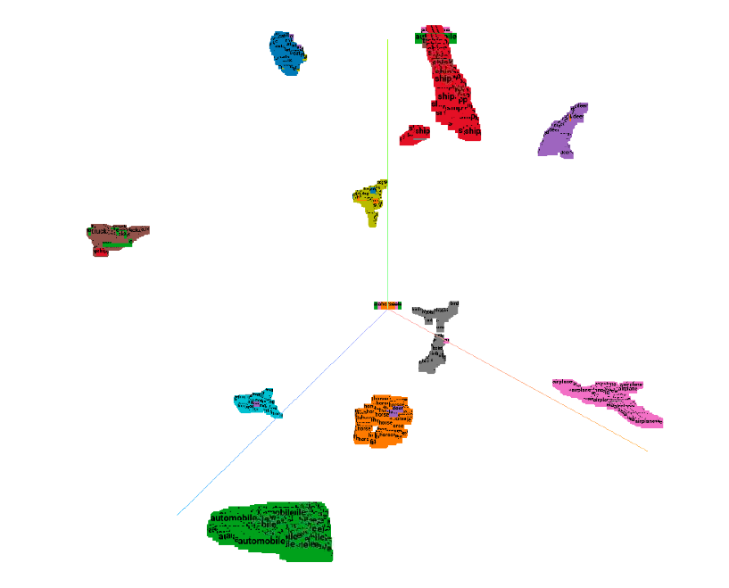
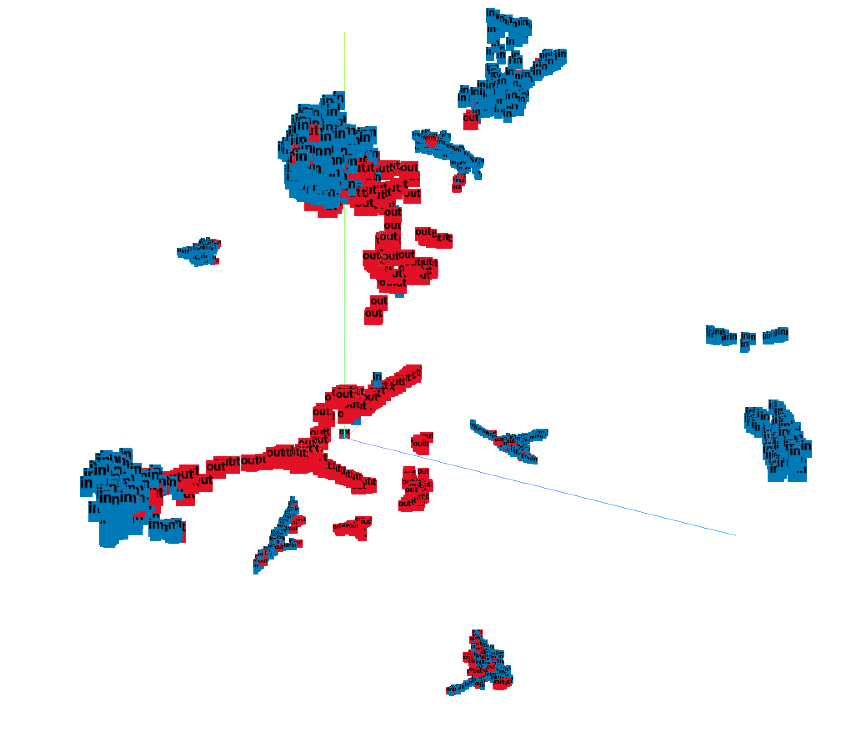

# OODformer: Out-Of-Distribution Detection Transformer

This repo is the official the implementation of the [OODformer: Out-Of-Distribution Detection Transformer](https://arxiv.org/abs/2107.08976) in PyTorch using CIFAR as an illustrative example:  
##Getting started

At first please install all the dependencies using :
`pip install -r requirement.txt`
##Datasets
Please download all the in-distribution ([CIFAR-10,CIFAR-100](https://www.cs.toronto.edu/~kriz/cifar.html),[ImageNet-30](https://drive.google.com/file/d/1B5c39Fc3haOPzlehzmpTLz6xLtGyKEy4/view)) and 
out-of-distribution dataset([LSUN_resize](https://www.dropbox.com/s/moqh2wh8696c3yl/LSUN_resize.tar.gz),
 [ImageNet_resize](https://www.dropbox.com/s/kp3my3412u5k9rl/Imagenet_resize.tar.gz),
  [Places-365](http://data.csail.mit.edu/places/places365/val_256.tar), 
[DTD](https://www.robots.ox.ac.uk/~vgg/data/dtd/),
 [Stanford Dogs](http://vision.stanford.edu/aditya86/ImageNetDogs/), 
 [Food-101](https://www.kaggle.com/dansbecker/food-101), 
 [Caltech-256](https://www.kaggle.com/jessicali9530/caltech256), 
 [CUB-200](http://www.vision.caltech.edu/visipedia/CUB-200-2011.html)) to `data` folder under the root directory.
## Training 
For training Vision Transformer and its Data efficient variant please download their corresponding pre-train weight from [ViT](https://github.com/rwightman/pytorch-image-models/blob/master/timm/models/vision_transformer.py) and 
[DeiT](https://github.com/facebookresearch/deit) repository.
 
To fine-tune vision transformer network on any in-distribution dataset on multi GPU settings:
```
srun --gres=gpu:4  python vit/src/train.py --exp-name name_of_the_experimet --tensorboard --model-arch b16 --checkpoint-path path/to/checkpoint --image-size 224 --data-dir data/ImageNet30 --dataset ImageNet --num-classes 30 --train-steps 4590 --lr 0.01 --wd 1e-5 --n-gpu 4 --num-workers 16 --batch-size 512 --method SupCE
```
- model-arch :  specify the model of vit and deit variants (see vit/src/config.py )
- method : currently we support only supervised cross-entropy
- train_steps : cyclic lr has been used for lr scheduler, number of training epoch can be calculated using ```
 (#train steps* batch size)/#training samples```
- checkpoint_path : for loading pre-trained weight of vision transformer based on their different model.

### Training Support
OODformer can also be trained with various supervised and self-supervised loss like :

- [x] Supervised Cross Entropy
- [ ] [Self-Supervised Contrastive Loss](https://arxiv.org/abs/2002.05709)[TBD]
- [ ] [Supervised Contrastive Loss](https://arxiv.org/abs/2004.11362)[TBD]
- [ ] [Self-Supervised Vision Transformer](https://arxiv.org/abs/2104.14294)[TBD]

### Training Base ResNet model
To train resnet variants(e.g., resent-50,wide-resent) as base model on in-distribution dataset :
```
srun --gres=gpu:4  python main_ce.py --batch_size 512 --epochs 500 --model resent34 --learning_rate 0.8  --cosine --warm --dataset cifar10
```

## Evaluation 
To evaluate the similarity distance from the mean embedding of an in-distribution (e.g., CIFAR-10) class a list of distance metrics (e.g., Mahalanobis, Cosine, Euclidean, and Softmax) can be used with OODformer as stated below :
```
srun --gres=gpu:1 python OOD_Distance.py --ckpt checkpoint_path --model vit --model_arch b16 --distance Mahalanobis --dataset id_dataset --out_dataset ood_dataset
``` 

## Visualization
Various embedding visualization can be viewed using ```generate_tsne.py``` 

**(1) UMAP of in-distribution embedding**
<p align="center">
  
</p>

**(2) UMAP of combined in and out-of distribution embedding**
<p align="center">
  
</p>

## Reference
```
@article{koner2021oodformer,
  title={OODformer: Out-Of-Distribution Detection Transformer},
  author={Koner, Rajat and Sinhamahapatra, Poulami and Roscher, Karsten and G{\"u}nnemann, Stephan and Tresp, Volker},
  journal={arXiv preprint arXiv:2107.08976},
  year={2021}
}
```
## Acknowledgments
Part of this code is inspired by [HobbitLong/SupContrast](https://github.com/HobbitLong/SupContrast).